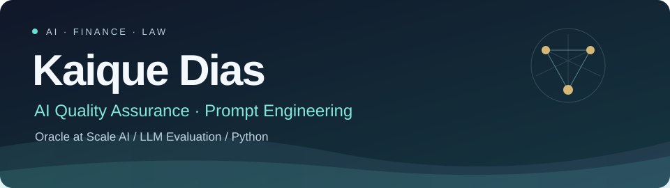
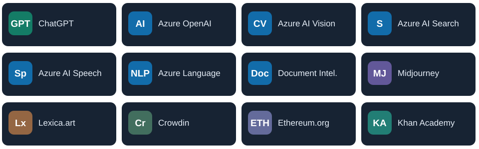
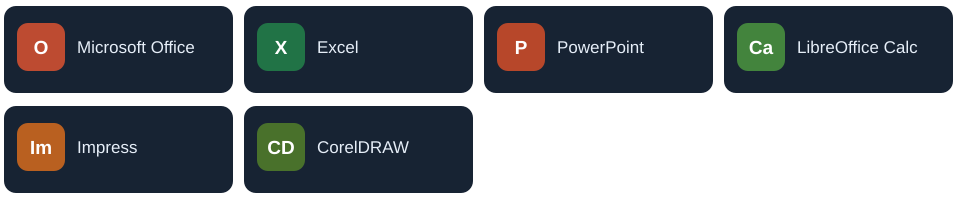

### About me

I'm **Kaique Dias**, based in Rio de Janeiro, Brazil. I work as an **Oracle at Scale AI**, reviewing complex model responses, refining prompts and helping maintain quality standards. Much of this work comes down to judgment: understanding context, resolving ambiguity and knowing when an answer needs a closer look.

My background spans financial markets, leadership and law. Over the past decade, investments and risk management have shaped how I approach decisions. I'm also in the final semester of my **Law degree at Universidade Estácio de Sá**, with an interest in how regulation, security and emerging technologies affect one another.

Here I share projects in **Python, AI quality assurance and prompt engineering**, alongside my research. I value clear reasoning, work that can be checked and results that have a practical purpose.

### What I focus on

| AI quality & QA | Prompt engineering | Python & data |
| :--- | :--- | :--- |
| LLM output evaluation | Clear instructions & constraints | Small, testable CLI tools |
| Edge cases & risk-aware review | Prompt analysis & refinement | Data validation & reporting |
| Trust & Safety, policy compliance | Repeatable evaluation criteria | Unit tests & GitHub Actions |

### Main toolkit

**Python · C · Git/GitHub · GitHub Actions · GitLab · Azure · Linux · Windows · macOS · Photoshop**

My toolkit brings together tools I use at work, technologies I study and platforms where I contribute.

<strong>AI services, creative tools & localization</strong>

 

My Azure training covers language, vision, search, speech and document intelligence. I've also contributed to localization through Crowdin, Ethereum.org, GitLab and Khan Academy.

<strong>Productivity & design</strong>

 

I also work with spreadsheets, presentations and design, and have experience teaching technology.

### Learning & qualifications

- **Python Programming — USP**; **Full Stack Development — IBM**.
- **Azure AI / AI-102 training**, including NLP, computer vision, AI Search, speech and document intelligence.
- **Git/GitHub, prompt writing and generative AI — DIO**.
- Continuing interests: **AI automation, cybersecurity and OSINT**.

### Python projects

These projects bring together my work with AI quality, my interest in training models and my background in financial markets. Each includes examples you can run and tests for the main checks.

| Project | What it does |
| :--- | :--- |
| [**Fine-tune Data Prep**](https://github.com/DrKaiqueDias/finetune-data-prep) | Checks instruction datasets and builds repeatable train/validation splits |
| [**Text Training Baseline**](https://github.com/DrKaiqueDias/text-training-baseline) | Trains a text classifier and evaluates it on separate data |
| [**LLM Eval Lite**](https://github.com/DrKaiqueDias/llm-eval-lite) | Checks saved model responses against explicit rules |
| [**CSV Quality Audit**](https://github.com/DrKaiqueDias/csv-quality-audit) | Checks CSV files for missing values, invalid numbers and malformed rows |
| [**Portfolio Risk Lab**](https://github.com/DrKaiqueDias/portfolio-risk-lab) | Calculates returns, volatility and drawdown from portfolio values |

### Research & initiatives

[**Consciousness, Autonomy and Decentralization**](https://github.com/DrKaiqueDias/consciousness-autonomy-decentralization)  
My SSRN paper explores human development, autonomy and Bitcoin. [Read on SSRN ↗](https://papers.ssrn.com/sol3/papers.cfm?abstract_id=6439340)

I also built a healthcare data MVP combining blockchain, AI facial recognition, patient-consented sharing and smart-contract traceability.

### Let's connect

I'm open to exchanging ideas about **AI evaluation, QA and prompt engineering**, especially with people working through these problems in practice.  
[**Connect with me on LinkedIn ↗**](https://www.linkedin.com/in/kaique-dias-541b23324)

---

### Beyond the work

A small animation of my contributions: two snakes take different routes and meet again near the end.

<picture>
  <source media="(prefers-color-scheme: dark)" srcset="https://raw.githubusercontent.com/DrKaiqueDias/DrKaiqueDias/output/github-snake-dark.svg" />
  <source media="(prefers-color-scheme: light)" srcset="https://raw.githubusercontent.com/DrKaiqueDias/DrKaiqueDias/output/github-snake.svg" />
  
</picture>

