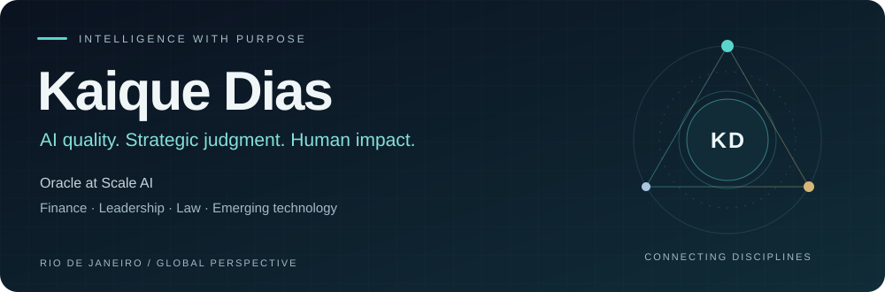
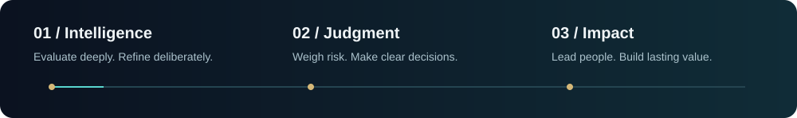

  

  <a href="https://www.linkedin.com/in/kaique-dias-541b23324"><strong>CONNECT ON LINKEDIN ↗</strong></a>

## A multidisciplinary perspective

I work where **AI, strategic execution, and human judgment** meet. As an **Oracle at Scale AI**, I evaluate complex model behavior, resolve ambiguities, refine prompts, and strengthen quality standards. Mentoring advanced reviewers is part of how I turn individual insight into collective improvement.

A decade in **financial markets** shaped my analytical foundation: understanding uncertainty, weighing risk, and making decisions with consequences. Leadership across professional education and startups taught me to translate that thinking into team development, operational scale, and commercial growth.

I am completing my **Law degree at Universidade Estácio de Sá**, bringing a legal and regulatory lens to emerging technology. Based in **Rio de Janeiro**, fluent in **English**, and driven by work with lasting impact.

  

## Areas of focus

| Artificial intelligence | Strategy & leadership | Law & innovation |
| :--- | :--- | :--- |
| LLM evaluation & quality benchmarks | Market intelligence & portfolio strategy | Legal & regulatory perspective |
| Prompt refinement & edge-case analysis | Risk management & strategic execution | Data governance & cybersecurity interests |
| Validation workflows & reviewer mentoring | Team development & operational growth | Blockchain & responsible innovation |

## From idea to application

My **healthcare data MVP** brings together blockchain, AI facial recognition, patient-consented sharing, and smart-contract traceability. It reflects the questions that motivate me: how can technology be useful, how should information be governed, and how do we build around the people it serves?

## What drives me

**Clear thinking. Responsible execution. People first.**

I measure success through outcomes, but also through the people empowered along the way. I want my work to connect analytical depth with practical action—and leave something valuable behind.

---

<strong>LET’S BUILD SOMETHING THAT MATTERS.</strong> 
<a href="https://www.linkedin.com/in/kaique-dias-541b23324">AI quality · Strategic leadership · Responsible innovation ↗</a>

### My contribution calendar · in motion

<picture>
  <source media="(prefers-color-scheme: dark)" srcset="https://raw.githubusercontent.com/DrKaiqueDias/DrKaiqueDias/output/github-snake-dark.svg" />
  <source media="(prefers-color-scheme: light)" srcset="https://raw.githubusercontent.com/DrKaiqueDias/DrKaiqueDias/output/github-snake.svg" />
  
</picture>
